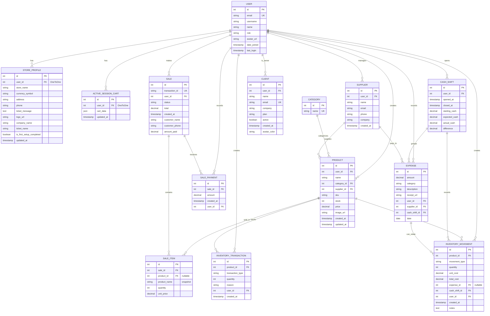

# Estructura de Base de Datos - Nurax Backend

## Diagrama ERD (Entity Relationship Diagram)

Este diagrama muestra todas las tablas y sus relaciones:



---

## Tablas Principales y Propósito

### 🔐 **Autenticación y Usuarios**

#### **USER** (auth_user + custom fields)
- Base de todo el sistema
- Se extiende de Django's AbstractUser
- **Campos únicos**: `email`
- **Roles**: ADMIN, CLIENTE
- **Relaciones**: Propietario de todos los datos

| Campo | Tipo | Notas |
|-------|------|-------|
| id | INT | PK |
| email | VARCHAR(255) | UNIQUE - Se usa para login |
| username | VARCHAR(150) | Requerido por Django |
| name | VARCHAR(150) | Nombre completo |
| role | VARCHAR(10) | ADMIN o CLIENTE |
| avatar_url | VARCHAR(800) | URL en Cloudinary |
| date_joined | TIMESTAMP | Auto |
| last_login | TIMESTAMP | Auto |

#### **CLIENT**
- Empresas que contratan el servicio
- OneToOne con USER (opcional)
- Contiene plan de suscripción

| Campo | Tipo | Notas |
|-------|------|-------|
| id | INT | PK |
| user_id | INT | FK(User) - nullable |
| name | VARCHAR(200) | |
| email | VARCHAR(255) | UNIQUE |
| company | VARCHAR(200) | Nombre empresa |
| plan | VARCHAR(15) | basico, pro |
| active | BOOLEAN | Estado suscripción |
| created_at | TIMESTAMP | Auto |
| avatar_color | VARCHAR(10) | Color para avatar |

#### **STORE_PROFILE**
- Configuración del negocio por usuario
- OneToOne con USER
- Define branding y config de tienda

| Campo | Tipo | Notas |
|-------|------|-------|
| id | INT | PK |
| user_id | INT | FK(User) - OneToOne |
| store_name | VARCHAR(200) | Ej: "Mi Tienda Electrónica" |
| currency_symbol | VARCHAR(10) | Ej: "$", "€" |
| address | VARCHAR(300) | Dirección física |
| phone | VARCHAR(30) | Teléfono negocio |
| ticket_message | TEXT | Mensaje en recibos |
| logo_url | VARCHAR(800) | Logo en Cloudinary |
| company_name | VARCHAR(200) | Para facturación |
| ticket_name | VARCHAR(100) | Nombre en tickets |
| is_first_setup_completed | BOOLEAN | Onboarding |
| updated_at | TIMESTAMP | Auto |

---

### 📦 **Inventario**

#### **CATEGORY**
- Categorización de productos
- **Simple pero crítica**
- Ej: Electrónica, Ropa, Alimentos

| Campo | Tipo | Notas |
|-------|------|-------|
| id | INT | PK |
| name | VARCHAR(100) | UNIQUE |

#### **SUPPLIER**
- Proveedores de productos
- Vinculado a USER (propietario)
- Puede tener múltiples productos

| Campo | Tipo | Notas |
|-------|------|-------|
| id | INT | PK |
| user_id | INT | FK(User) |
| name | VARCHAR(200) | Nombre proveedor |
| email | VARCHAR(255) | Contacto |
| phone | VARCHAR(20) | Teléfono |
| company | VARCHAR(200) | Empresa proveedor |
| created_at | TIMESTAMP | Auto |

#### **PRODUCT**
- **TABLA CRÍTICA**: Stock y precios
- Pertenece a un USER (multi-tenant)
- Vinculado a Category y Supplier

| Campo | Tipo | Notas |
|-------|------|-------|
| id | INT | PK |
| user_id | INT | FK(User) |
| name | VARCHAR(250) | Nombre producto |
| category_id | INT | FK(Category) |
| supplier_id | INT | FK(Supplier) - nullable |
| sku | VARCHAR(50) | Código único |
| stock | INT | Cantidad en almacén |
| price | DECIMAL(12,2) | Precio de venta |
| image_url | VARCHAR(800) | URL en Cloudinary |
| created_at | TIMESTAMP | Auto |
| updated_at | TIMESTAMP | Auto |

**Propiedades calculadas:**
- `status`: in_stock / low_stock (≤10) / out_of_stock (0)

---

### 🛒 **Ventas y Compras**

#### **SALE**
- **TABLA CRÍTICA**: Transacciones
- Estados: completed, pending, cancelled, credit, layaway
- Genera `transaction_id` único

| Campo | Tipo | Notas |
|-------|------|-------|
| id | INT | PK |
| transaction_id | VARCHAR(20) | UNIQUE - Ref visible |
| user_id | INT | FK(User) |
| status | VARCHAR(15) | completed, pending, credit, layaway, cancelled |
| total | DECIMAL(12,2) | Monto total |
| created_at | TIMESTAMP | Auto |
| customer_name | VARCHAR(200) | Ej: "Juan Pérez" |
| customer_phone | VARCHAR(20) | Teléfono cliente |
| amount_paid | DECIMAL(12,2) | Pagado (null si completa) |

**Propiedades calculadas:**
- `balance_due`: Saldo pendiente (total - pagos)

#### **SALE_ITEM**
- Ítems dentro de una venta
- Referencia a PRODUCT, pero guarda snapshot
- `product_name` preserva nombre en caso de borrado

| Campo | Tipo | Notas |
|-------|------|-------|
| id | INT | PK |
| sale_id | INT | FK(Sale) - CASCADE |
| product_id | INT | FK(Product) - nullable/SET_NULL |
| product_name | VARCHAR(250) | Snapshot del nombre |
| quantity | INT | Cantidad vendida |
| unit_price | DECIMAL(10,2) | Precio en momento venta |

**Propiedades:**
- `subtotal`: quantity × unit_price

#### **SALE_PAYMENT**
- Abonos a ventas en crédito/apartado
- Vinculado a SALE, registrado por USER
- Histórico de pagos parciales

| Campo | Tipo | Notas |
|-------|------|-------|
| id | INT | PK |
| sale_id | INT | FK(Sale) - CASCADE |
| amount | DECIMAL(12,2) | Monto abonado |
| created_at | TIMESTAMP | Auto |
| user_id | INT | FK(User) - Quién registró |

---

### 📊 **Inventario (Kárdex y Movimientos)**

#### **INVENTORY_TRANSACTION**
- **Histórico de movimientos** (tipo kárdex)
- Tipos: IN, OUT, ADJUSTMENT, WASTE
- Más simple, sin costos asociados
- Referencial para auditoría

| Campo | Tipo | Notas |
|-------|------|-------|
| id | INT | PK |
| product_id | INT | FK(Product) - CASCADE |
| transaction_type | VARCHAR(15) | in, out, adjustment, waste |
| quantity | INT | Cambio cantidad |
| reason | VARCHAR(255) | Motivo/nota |
| user_id | INT | FK(User) |
| created_at | TIMESTAMP | Auto |

#### **INVENTORY_MOVEMENT**
- **Movimientos detallados** con costos
- Vinculado a CASH_SHIFT (turno)
- Opcional: EXPENSE (para reabastecimiento costoso)
- Más robusto que InventoryTransaction

| Campo | Tipo | Notas |
|-------|------|-------|
| id | INT | PK |
| product_id | INT | FK(Product) - CASCADE |
| movement_type | VARCHAR(20) | sale, restock, adjust |
| quantity | INT | Unidades movidas |
| unit_cost | DECIMAL(10,2) | Costo unitario (restock) |
| total_cost | DECIMAL(12,2) | quantity × unit_cost |
| expense_id | INT | FK(Expense) - nullable |
| cash_shift_id | VARCHAR | FK(CashShift) - CASCADE |
| user_id | INT | FK(User) |
| created_at | TIMESTAMP | Auto |
| notes | TEXT | Observaciones |

---

### 💰 **Gastos y Cortes de Caja**

#### **EXPENSE**
- Egresos/gastos operacionales
- Categorías: servicios, nómina, proveedores, inventario, varios
- Opcional: vinculado a SUPPLIER
- Opcional: vinculado a CASH_SHIFT

| Campo | Tipo | Notas |
|-------|------|-------|
| id | INT | PK |
| amount | DECIMAL(12,2) | Monto gasto |
| category | VARCHAR(20) | servicios, nomina, proveedores, inventario, varios |
| description | VARCHAR(255) | Descripción |
| receipt_url | VARCHAR(800) | URL recibo (Cloudinary) |
| user_id | INT | FK(User) |
| supplier_id | INT | FK(Supplier) - nullable |
| cash_shift_id | INT | FK(CashShift) - nullable |
| date | DATE | Fecha gasto |

#### **CASH_SHIFT**
- **Cortes de caja / Turnos**
- Crítico para auditoría
- Abre: dinero inicial
- Cierra: compara esperado vs real

| Campo | Tipo | Notas |
|-------|------|-------|
| id | INT | PK |
| user_id | INT | FK(User) |
| opened_at | TIMESTAMP | Inicio turno - Auto |
| closed_at | TIMESTAMP | Cierre turno - nullable |
| starting_cash | DECIMAL(12,2) | Dinero inicial |
| expected_cash | DECIMAL(12,2) | Total esperado (calculado) |
| actual_cash | DECIMAL(12,2) | Dinero real en caja |
| difference | DECIMAL(12,2) | actual - expected |

**Lógica:**
```
expected_cash = starting_cash + sum(sales) - sum(expenses)
difference = actual_cash - expected_cash
```

---

### 🏪 **Sesión y Configuración**

#### **ACTIVE_SESSION_CART**
- Carrito temporal de sesión
- OneToOne con USER
- Data en JSON (flexible)
- Se actualiza con cada cambio

| Campo | Tipo | Notas |
|-------|------|-------|
| id | INT | PK |
| user_id | INT | FK(User) - OneToOne |
| cart_data | JSON | Array de items |
| updated_at | TIMESTAMP | Auto |

---

## Relaciones Clave (Join Logic)

### **Flujo: Usuario Realiza Venta**
```
USER → SALE → SALE_ITEM → PRODUCT
              → SALE_PAYMENT (si crédito/apartado)
       ↓
    CASH_SHIFT → INVENTORY_MOVEMENT → PRODUCT
              → EXPENSE
```

### **Flujo: Reabastecimiento**
```
SUPPLIER → PRODUCT (stock ↑)
        → EXPENSE (registro gasto)
        → INVENTORY_MOVEMENT (detail con costo)
        ↓
    CASH_SHIFT (agrupa todo)
```

### **Análisis: Productos más Vendidos**
```sql
SELECT 
    p.name, 
    SUM(si.quantity) as total_vendido,
    COUNT(DISTINCT s.id) as num_ventas
FROM product p
JOIN sale_item si ON p.id = si.product_id
JOIN sale s ON si.sale_id = s.id
WHERE p.user_id = ? AND s.created_at >= DATE_TRUNC('month', NOW())
GROUP BY p.id, p.name
ORDER BY total_vendido DESC;
```

### **Análisis: Balance Caja**
```sql
SELECT 
    cs.opened_at,
    cs.starting_cash,
    cs.expected_cash,
    cs.actual_cash,
    cs.difference
FROM cash_shift cs
WHERE cs.user_id = ? AND cs.closed_at >= ?
ORDER BY cs.opened_at DESC;
```

---

## Índices y Performance

**Índices recomendados:**

| Tabla | Campo(s) | Tipo |
|-------|----------|------|
| PRODUCT | (user_id, category_id) | Compound |
| SALE_ITEM | (sale_id), (product_id) | FK indexes |
| INVENTORY_MOVEMENT | (cash_shift_id), (product_id) | FK indexes |
| EXPENSE | (cash_shift_id), (user_id) | FK indexes |
| CASH_SHIFT | (user_id, closed_at) | Compound |

Django automáticamente crea índices para:
- Primary Keys (id)
- Foreign Keys
- Campos `unique=True`

---

## Constraints Implementados

| Constraint | Lugar | Descripción |
|-----------|-------|-------------|
| UNIQUE | User.email | Un email = un usuario |
| UNIQUE | Client.email | Un cliente por email |
| UNIQUE | Category.name | Nombres únicos |
| UNIQUE | Product.sku | SKU único por producto |
| UNIQUE | Sale.transaction_id | ID de transacción única |
| UNIQUE | StoreProfile (user_id) | OneToOne |
| UNIQUE | ActiveSessionCart (user_id) | OneToOne |
| FK (CASCADE) | SaleItem → Sale | Borrar venta = borrar items |
| FK (CASCADE) | InventoryMovement → CashShift | Borrar turno = mover items |
| FK (SET_NULL) | SaleItem → Product | Producto borrado = nullear ref |
| FK (SET_NULL) | SalePayment → Sale | Sale borrada = deslinc pagos |

---

## Ejemplos de Queries (Django ORM)

### **Obtener productos de usuario con stock bajo**
```python
from api.models import Product

low_stock = Product.objects.filter(
    user=request.user,
    stock__lte=10
).select_related('category', 'supplier')
```

### **Ventas de hoy**
```python
from api.models import Sale
from django.utils import timezone

today = timezone.now().date()
sales_today = Sale.objects.filter(
    user=request.user,
    created_at__date=today
).prefetch_related('items', 'payments')
```

### **Balance de un turno cerrado**
```python
from api.models import CashShift

shift = CashShift.objects.get(id=1)
print(f"Esperado: ${shift.expected_cash}")
print(f"Real: ${shift.actual_cash}")
print(f"Diferencia: ${shift.difference}")
```

### **Productos proveedores por un supplier específico**
```python
products = Product.objects.filter(
    supplier__id=supplier_id,
    user=request.user
).values_list('name', 'stock', 'price')
```

---

## Migración Django

Ver historial de cambios:

```bash
docker exec nurax_api python manage.py showmigrations
```

Cambios realizados (últimas migraciones):
- **0001**: Inicial (User, Product, Sale, etc)
- **0002**: Alteró User.email
- **0003**: Removió Product.image, agregó image_url
- **0004**: Agregó User.avatar_url
- **0005**: Agregó StoreProfile
- **0006**: Alteró Sale.status, agregó Expense, etc
- **0007**: Agregó relaciones Category/Supplier/User
- **0008**: Removió Category.user
- **0009**: Agregó StoreProfile.user OneToOne
- **0010**: Agregó ActiveSessionCart
- **0011**: Agregó Sale.amount_paid, customer_name, customer_phone
- **0012**: Agregó Expense.supplier, cash_shift
- **0013**: Agregó StoreProfile.company_name, is_first_setup_completed

---

**Última actualización:** Marzo 2026  
**Total Tablas:** 13  
**Total Relaciones:** 24+  
**Estado:** Estable
